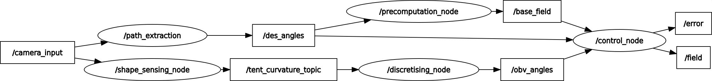

# Adaptive Shape Control

ROS implementation of the Shape-Forming Adaptive Controller found in [Tentacle Adaptive Controller](https://github.com/VFrancescon/TentacleAdaptiveController).

## Table of Contents

- [Installation](#installation)
- [Dev Notes](#dev-notes)
- [Usage](#usage)

## Installation

```bash
sudo apt install python3-rosdep python3-catkin-tools
cd ~/ros_ws
rosdep update && rosdep install --from-paths src/ -y -r
catkin build
```

### Other dependencies

[Messages](https://github.com/Stormlabuk/shapeforming_msgs)

[Path Planner](https://github.com/VFrancescon/Heuristic_path_planners) - own fork.

## Dev Notes

### To-Do

- [x] Annotate Discretisation Node
- [x] Wire up all the nodes, implementation follows later.
  - [x] Centre-line extractor
- [ ] Implement precomputation node
  - [ ] Ensure field precals are trigger-based
- [ ] Implement error calculating node
- [ ] Implement control loop node
- [ ] Implement path extractor node
- [ ] Implement an image processing node
- [ ] Make it pass the centre-line to the discretisation node
- [ ] Make number of joints in disc node a ros_param

### Nodes

- [Control Loop](src/control_loop.cpp) takes in the shape info and figures out the error. It will publish either the updated field or the the error, TBD.

- [Precomputation Node](src/precomputation_node.cpp) takes in desired shape and calculates the required field.

- [Shape Sensing](src/shape_sensing.cpp) takes in sensor input to calculate the observed shape and publish it out.

- [Discretisation Node](scripts/discretising_node.py) Takes a centre-line using service [DiscreteCurve](srv/DiscretiseCurve.srv) and publishes its rigid-link joint representation through [rl_angles](msg/rl_angles.msg). The number of joints is currently hardcoded, but should be passed in [DiscreteCurve](srv/DiscretiseCurve.srv) call, this will likely be an integer advertised by the [Control Loop](src/control_loop.cpp).

- [Path extractor node](src/path_extractor.cpp) Takes in an image of the phantom and calculates a centre-line, which is then translated to joint desired joint angles, which arefed to the [precomputation node](src/precomputation_node.cpp).

### Node graph



### Topics

- "/Tent_Shape", calculated and published by [Shape Sensing](src/shape_sensing.cpp).
- "/Error", calculated and published by [Control Loop](src/control_loop.cpp).

### Messages

- [Shape](msg/rl_shape.msg) holds the shape sensed by [Shape Sensing](src/shape_sensing.cpp).
- [Error](msg/error.msg) holds the error calculated by [Control Loop](src/control_loop.cpp)

## Usage

Instructions on how to use the project and any relevant examples.

## Contributing

Guidelines on how to contribute to the project and any specific requirements.

## License

Information about the project's license and any additional terms or conditions.

## Contact

Vittorio Francescon, University of Leeds [el21vf@leeds.ac.uk](mailto:el21vf@leeds.ac.uk)
