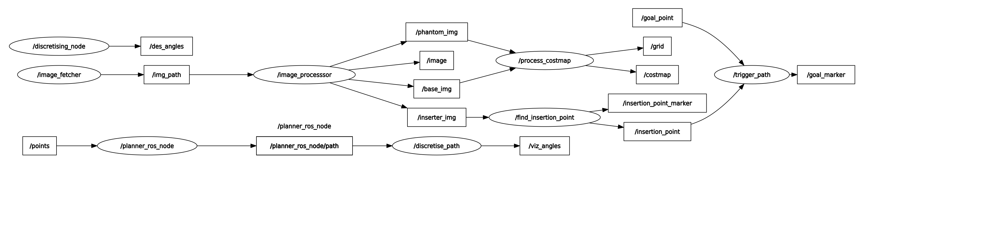

# Adaptive Shape Control

ROS implementation of the Shape-Forming Adaptive Controller found in [Tentacle Adaptive Controller](https://github.com/VFrancescon/TentacleAdaptiveController).

## Table of Contents

- [Installation](#installation)
- [Dev Notes](#dev-notes)
- [Usage](#usage)

## Installation

```bash
sudo apt install python3-rosdep python3-catkin-tools
cd ~/ros_ws
rosdep update && rosdep install --from-paths src/ -y -r
catkin build
```

### Other dependencies

[Messages](https://github.com/Stormlabuk/shapeforming_msgs)

[Path Planner](https://github.com/VFrancescon/Heuristic_path_planners) - own fork.

## Dev Notes

### To-Do

- [x] Rewrite Todo
- [x] Document written nodes
- [ ] Write out precomputation node
- [ ] Write out controller node
- [ ] Write out error calculation
- [ ] Connect CV section to a live camera input
- [ ] Use live camera input for shape sensing

### Nodes

#### CV Side

|      Node Name       |                                                 Functionality                                                 |                                      Subscribers                                      |                                               Publishers                                                |              Services              | Done |
| :------------------: | :-----------------------------------------------------------------------------------------------------------: | :-----------------------------------------------------------------------------------: | :-----------------------------------------------------------------------------------------------------: | :--------------------------------: | :--: |
|    image_fetcher     |                          Finds image paths and forwards them to the image_processor                           |                                         None                                          |                                    **std_msgs::String** img_path                                     |                None                |  ✅   |
|   image_processor    | Applies contour based filtering to the fetched image path. Publishes forward the phantom and inserter images. |                           **std_msgs::String** img_path                            |                    **sensor_msgs::Image** phantom_img inserter_img base_img                    |                None                |  ✅   |
| find_insertion_point |                            Processes inserter contour to find the insertion point                             |                        **sensor_msgs::Image** inserter_img                         | **geometry_msgs::Point** insertion_point **visualization_msgs::Marker** insertion_point_marker |                None                |  ✅   |
|   process_costmap    |                              Processes inserter and phantom contour as costmaps                               |                   **sensor_msgs::Image** phantom_img base_img                   |                               **nav_msgs::OccupancyGrid** grid map                                |                None                |  ✅   |
|     trigger_path     |  Takes in insertion point, checks that the costmap is up to date and requests a path with an arbitrary goal   | **geometry_msgs::Point** insertion_point **nav_msgs::OccupancyGrid** costmap |                                                  None                                                   |    Heuristic_Planners::GetPath     |  ✅   |
|   discretise_path    |                                 Takes in path and discretises it to RL domain                                 |                              **nav_msgs::Path**  path                              |     **shapeforming_msgs::rl_angles** des_angles **visualization_msgs::Marker** viz_angles      | shapeforming_msgs::DiscretiseCurve |  ✅   |

#### Control side

### Node graph



## Usage

Instructions on how to use the project and any relevant examples.

## Contributing

Guidelines on how to contribute to the project and any specific requirements.

## License

Information about the project's license and any additional terms or conditions.

## Contact

Vittorio Francescon, University of Leeds [el21vf@leeds.ac.uk](mailto:el21vf@leeds.ac.uk)
